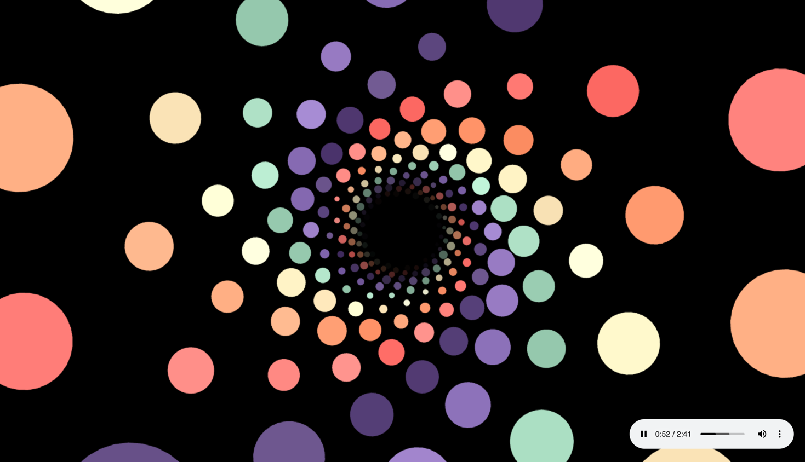

<h1 align="center">  3D Music Visualization <i>v2</i></h1>

## About

3D visualization of music using Three.js and web audio API

[Try it here](https://l1ve4code.github.io/3d-music-visualizer-v2/)

### Main screen



### Technologies

* Language: **TS, JS**
* Library: **THREE.js**
* Technologies: **Web Audio API, Webpack**

## Installing

**Firstly** clone the project.

```git
git clone https://github.com/l1ve4code/3d-music-visualizer-v2.git
```

**Secondly** install dependencies
```cmd
npm install
```

**Thirdly** run project

### For watch or development

```cmd
npm run dev
```

### For build

```cmd
npm run build
```

## Author of _Music Animation_

* Telegram: **[@live4code](https://t.me/live4code)**
* Email: **steven.marelly@gmail.com**

## Author of _THREE.js Animation_

* Web-site: **https://www.mamboleoo.be/articles/tunnel-animation-1**
* Codepen: **https://codepen.io/Mamboleoo/pen/mJWLVJ**
